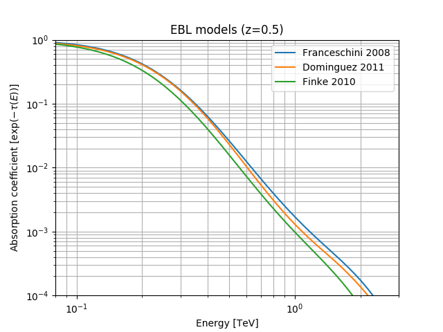

# Models for extragalactic backgound light (EBL)

Available models are:
 - Franceschini 2008 (http://adsabs.harvard.edu/abs/2008A%26A...487..837F)
 - Dominguez 2011 (http://adsabs.harvard.edu/cgi-bin/bib_query?arXiv:1007.1459)
 - Finke 2010 (http://adsabs.harvard.edu/abs/2009arXiv0905.1115F)

Todo: 
Format of binary files is referenced here: https://gamma-astro-data-formats.readthedocs.io/en/latest/
